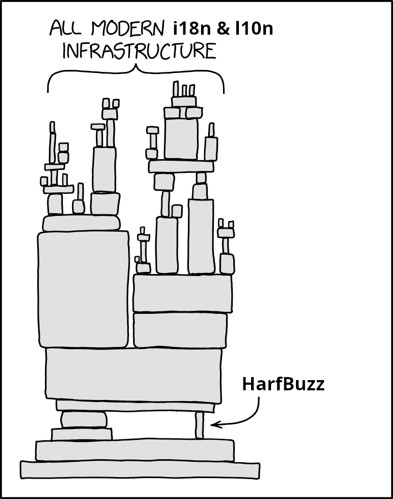

# HarfBuzz

HarfBuzz is a text shaping engine. It primarily supports [OpenType][1], but also
[Apple Advanced Typography][2]. HarfBuzz is used in Android, Chrome,
ChromeOS, Firefox, GNOME, GTK+, KDE, Qt, LibreOffice, OpenJDK, XeTeX,
PlayStation, Microsoft Edge, Adobe Photoshop, Illustrator, InDesign,
Godot Engine, Unreal Engine, and other places.

For bug reports, mailing list, and other information please visit:

  http://harfbuzz.org/

For license information, see [COPYING](COPYING).

## Documentation

For user manual as well as API documentation, check: https://harfbuzz.github.io

## Download

For tarball releases of HarfBuzz, look [here][3]. At the same place you
will also find Win32/Win64 binary bundles that include `libharfbuzz` DLL,
`hb-view.exe`, `hb-shape.exe`, and all dependencies.

The canonical source tree is available on [github][4].
Both development and user support discussion around HarfBuzz happens on
[github][4] as well.

The API that comes with `hb.h` will not change incompatibly. Other, peripheral,
headers are more likely to go through minor modifications, but again, we do our
best to never change API in an incompatible way. We will never break the ABI.

The API and ABI are stable even across major version number jumps. In fact,
current HarfBuzz is API/ABI compatible all the way back to the 0.9.x series.
If one day we need to break the API/ABI, that would be called a new a library.

As such, we bump the major version number only when we add major new features,
the minor version when there is new API, and the micro version when there
are bug fixes.

## Development

For build information, see [BUILD.md](BUILD.md).

For custom configurations, see [CONFIG.md](CONFIG.md).

For testing and profiling, see [TESTING.md](TESTING.md).

For using with Python, see [README.python.md](README.python.md). There is also [uharfbuzz](https://github.com/harfbuzz/uharfbuzz).

For cross-compiling to Windows from Linux or macOS, see [README.mingw.md](README.mingw.md).

To report bugs or submit patches please use [github][4] issues and pull-requests.

### Developer documents

To get a better idea of where HarfBuzz stands in the text rendering stack you
may want to read [State of Text Rendering 2024][6].
Here are a few presentation slides about HarfBuzz at the
Internationalization and Unicode Conference over the years:

-   November 2014, [Unicode, OpenType, and HarfBuzz: Closing the Circle][7],
-   October 2012, [HarfBuzz, The Free and Open Text Shaping Engine][8],
-   October 2009, [HarfBuzz: the Free and Open Shaping Engine][9].

More presentations and papers are available on [behdad][11]'s website.
In particular, the following documents are relevant to HarfBuzz development:

- 2025 — HarfBuzz Study: Caching — [Paper][12]
- 2025 — HarfBuzz Study: `hb-decycler` — [Paper][13]
- 2022 — HarfBuzz Study: `hb-iter` — [Paper][14]
- 2022 — HarfBuzz Study: A C library written in C++ — [Paper][15]
- 2022 — HarfBuzz Study: PackTab: A static integer table packer — [Paper][16]
- 2014 — Reflections on Building the HarfBuzz Indic Shaper — [Paper][17]
- 2012 — HarfBuzz Memory Consumption — [Paper][10]

## Name

HarfBuzz (حرف‌باز) is the literal Persian translation of “[OpenType][1]”,
transliterated using the Latin script. It also means "talkative" or
"glib" (also a nod to the GNOME project where HarfBuzz originates from).

> Background: Originally there was this font format called TrueType. People and
> companies started calling their type engines all things ending in Type:
> FreeType, CoolType, ClearType, etc. And then came OpenType, which is the
> successor of TrueType. So, for my OpenType implementation, I decided to stick
> with the concept but use the Persian translation. Which is fitting given that
> Persian is written in the Arabic script, and OpenType is an extension of
> TrueType that adds support for complex script rendering, and HarfBuzz is an
> implementation of OpenType complex text shaping.

  
Packaging status of HarfBuzz

[1]: https://docs.microsoft.com/en-us/typography/opentype/spec/
[2]: https://developer.apple.com/fonts/TrueType-Reference-Manual/RM06/Chap6AATIntro.html
[3]: https://github.com/harfbuzz/harfbuzz/releases
[4]: https://github.com/harfbuzz/harfbuzz
[6]: http://behdad.org/text2024
[7]: https://docs.google.com/presentation/d/1x97pfbB1gbD53Yhz6-_yBUozQMVJ_5yMqqR_D-R7b7I/preview
[8]: https://docs.google.com/presentation/d/1ySTZaXP5XKFg0OpmHZM00v5b17GSr3ojnzJekl4U8qI/preview
[9]: http://behdad.org/download/Presentations/slippy/harfbuzz_slides.pdf
[10]: https://docs.google.com/document/d/12jfNpQJzeVIAxoUSpk7KziyINAa1msbGliyXqguS86M/preview
[11]: https://behdad.org/
[12]: https://docs.google.com/document/d/1_VgObf6Je0J8byMLsi7HCQHnKo2emGnx_ib_sHo-bt4/preview
[13]: https://docs.google.com/document/d/1Y-u08l9YhObRVObETZt1k8f_5lQdOix9TRH3zEXaoAw/preview
[14]: https://docs.google.com/document/d/1o-xvxCbgMe9JYFHLVnPjk01ZY_8Cj0vB9-KTI1d0nyk/preview
[15]: https://docs.google.com/document/d/18hI56KJpvXtwWbc9QSaz9zzhJwIMnrJ-zkAaKS-W-8k/preview
[16]: https://docs.google.com/document/d/1Xq3owVt61HVkJqbLFHl73il6pcTy6PdPJJ7bSouQiQw/preview
[17]: https://docs.google.com/document/d/1wMPwVNBvsIriamcyBO5aNs7Cdr8lmbwLJ8GmZBAswF4/preview
