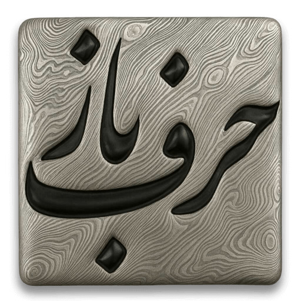
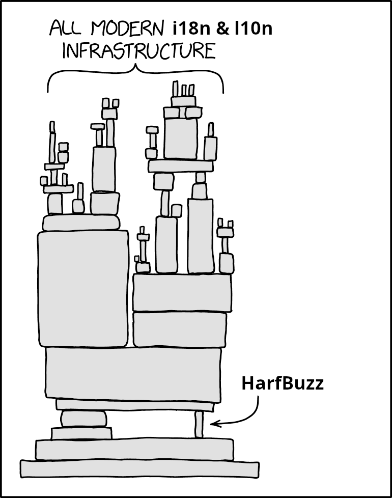

# HarfBuzz

HarfBuzz started as a text shaping engine but has grown into a
full font platform — the `ffmpeg` of text shaping.  It primarily
supports [OpenType][1], but also [Apple Advanced Typography][2].

HarfBuzz shapes the majority of text on modern screens.

HarfBuzz is optimized for robustness, correctness, and performance
— in that order. Achieve all.

**[Try it live at harfbuzz-world.cc](https://harfbuzz-world.cc/)** — an interactive playground for shaping, subsetting, rasterization, vector output, and GPU rendering, all running in your browser.

Here is a quick map of its components:

### Core libraries

| Library | Description |
|---------|-------------|
| **libharfbuzz** | Text shaping, draw API, paint API. Highly configurable (see [CONFIG.md](CONFIG.md)). Optional integration backends compiled in: hb-ft (FreeType), hb-coretext (macOS), hb-uniscribe (Windows), hb-directwrite (Windows), hb-gdi (Windows), hb-glib, hb-graphite2. |
| **libharfbuzz-subset** | Font subsetting and variable-font instancing. |

### Auxiliary libraries

| Library | Description |
|---------|-------------|
| **libharfbuzz-icu** | ICU Unicode integration. |
| **libharfbuzz-cairo** | Cairo rendering integration. |
| **libharfbuzz-gobject** | GObject/GI bindings. |

### Experimental libraries

| Library | Description |
|---------|-------------|
| **libharfbuzz-raster** | Glyph rasterization to bitmaps, including color fonts. Uses hb-draw and hb-paint. |
| **libharfbuzz-vector** | Glyph output to vector formats (currently SVG), including color fonts. Uses hb-draw and hb-paint. |
| **libharfbuzz-gpu** | Encodes glyph outlines for GPU rasterization (Slug algorithm). Provides shader sources in GLSL, WGSL, MSL, and HLSL. [Live demo.](https://harfbuzz.github.io/hb-gpu-demo/) |

Notable missing feature: font hinting (including autohinting)
is not implemented.  For hinted rasterization, use FreeType or
Skrifa.

For simplified builds, amalgamated sources are available:
`harfbuzz.cc` (just libharfbuzz), `harfbuzz-subset.cc` (just
libharfbuzz-subset), or `harfbuzz-world.cc` (everything, driven
by a custom `hb-features.h`).  For a live in-browser playground
plus a worked example of the world.cc single-file build, see
[harfbuzz-world.cc][26].

### Command-line tools

| Tool | Description |
|------|-------------|
| **hb-shape** | Shape text and display glyph output. |
| **hb-view** | Render shaped text to an image. |
| **hb-subset** | Subset and optimize fonts. |
| **hb-info** | Display font metadata. |
| **hb-raster** | Render glyphs to bitmap images. |
| **hb-vector** | Render glyphs to vector formats (SVG). |
| **hb-gpu** | Interactive GPU text rendering. |

The canonical source tree and bug trackers are available on [github][4].
Both development and user support discussion around HarfBuzz happen on
[github][4] as well.

For license information, see [COPYING](COPYING).

## API stability

The API that comes with `hb.h` will not change incompatibly. Other, peripheral,
headers are more likely to go through minor modifications, but again, we do our
best to never change API in an incompatible way. We will never break the ABI.

The API and ABI are stable even across major version number jumps. In fact,
current HarfBuzz is API/ABI compatible all the way back to the 0.9.x series.
If one day we need to break the API/ABI, that would be called a new library.

As such, we bump the major version number only when we add major new features,
the minor version when there is new API, and the micro version when there
are bug fixes.

## Documentation

For user manual as well as API documentation, check: https://harfbuzz.github.io

## Download

Tarball releases and Win32/Win64 binary bundles are available on the
[github releases][3] page.

## Development

For build information, see [BUILD.md](BUILD.md).

For custom configurations, see [CONFIG.md](CONFIG.md).

For testing and profiling, see [TESTING.md](TESTING.md).

For using with Python, see [README.python.md](README.python.md). There is also [uharfbuzz](https://github.com/harfbuzz/uharfbuzz).

For cross-compiling to Windows from Linux or macOS, see [README.mingw.md](README.mingw.md).

To report bugs or submit patches please use [github][4] issues and pull-requests.

### Developer documents

To get a better idea of where HarfBuzz stands in the text rendering stack you
may want to read [State of Text Rendering 2024][6].
Here are a few presentation slides about HarfBuzz over the years:

- 2026 – [HarfBuzz at 20!][25]
- 2016 – [Ten Years of HarfBuzz][20]
- 2014 – [Unicode, OpenType, and HarfBuzz: Closing the Circle][7]
- 2012 – [HarfBuzz, The Free and Open Text Shaping Engine][8]
- 2009 – [HarfBuzz: the Free and Open Shaping Engine][9]

More presentations and papers are available on [behdad][11]'s website.
In particular, the following _studies_ are relevant to HarfBuzz development:

- 2025 – [AAT layout caches][24]
- 2025 – [OpenType Layout lookup caches][23]
- 2025 – [Introducing HarfRust][22]
- 2025 – [Subsetting][21]
- 2025 – [Caching][12]
- 2025 – [`hb-decycler`][13]
- 2022 – [`hb-iter`][14]
- 2022 – [A C library written in C++][15]
- 2022 – [The case of the slow `hb-ft` `>h_advance` function][18]
- 2022 – [PackTab: A static integer table packer][16]
- 2020 – [HarfBuzz OT+AAT "Unishaper"][19]
- 2014 – [Building the Indic Shaper][17]
- 2012 – [Memory Consumption][10]

## Name

HarfBuzz /hærfˈbɒːz/

From Persian حرف (*Harf*: letter) and باز (*Buzz*: open).
Transliteration of the Persian calque for *OpenType*.

As a noun: *The* Open Source *text shaping* engine.

As an adjective: Insincerely talkative; glib. A nod to the
GNOME project where HarfBuzz originates from.

The logo shows حرف‌باز in the IranNastaliq font, on a Damascus
steel background.

> Background: Originally there was this font format called TrueType. People and
> companies started calling their type engines all things ending in Type:
> FreeType, CoolType, ClearType, etc. And then came OpenType, which is the
> successor of TrueType. So, for my OpenType implementation, I decided to stick
> with the concept but use the Persian translation. Which is fitting given that
> Persian is written in the Arabic script, and OpenType is an extension of
> TrueType that adds support for complex script rendering, and HarfBuzz is an
> implementation of OpenType text shaping.

## Users

HarfBuzz is used in Android, Chrome, ChromeOS, Firefox, Flutter, GNOME, GTK+, KDE,
Qt, LibreOffice, OpenJDK, XeTeX, Adobe Photoshop, Illustrator, InDesign,
Microsoft Edge, Amazon Kindle, PlayStation, Godot Engine, Unreal Engine,
Figma, Canva, QuarkXPress, Scribus, smart TVs,
car displays, and many other places.

  

## Distribution

  
Packaging status of HarfBuzz

[1]: https://docs.microsoft.com/en-us/typography/opentype/spec/
[2]: https://developer.apple.com/fonts/TrueType-Reference-Manual/RM06/Chap6AATIntro.html
[3]: https://github.com/harfbuzz/harfbuzz/releases
[4]: https://github.com/harfbuzz/harfbuzz
[6]: https://behdad.org/text2024
[7]: https://docs.google.com/presentation/d/1x97pfbB1gbD53Yhz6-_yBUozQMVJ_5yMqqR_D-R7b7I/preview
[8]: https://docs.google.com/presentation/d/1ySTZaXP5XKFg0OpmHZM00v5b17GSr3ojnzJekl4U8qI/preview
[9]: https://behdad.org/doc/harfbuzz2009-slides.pdf
[10]: https://docs.google.com/document/d/12jfNpQJzeVIAxoUSpk7KziyINAa1msbGliyXqguS86M/preview
[11]: https://behdad.org/
[12]: https://docs.google.com/document/d/1_VgObf6Je0J8byMLsi7HCQHnKo2emGnx_ib_sHo-bt4/preview
[13]: https://docs.google.com/document/d/1Y-u08l9YhObRVObETZt1k8f_5lQdOix9TRH3zEXaoAw/preview
[14]: https://docs.google.com/document/d/1o-xvxCbgMe9JYFHLVnPjk01ZY_8Cj0vB9-KTI1d0nyk/preview
[15]: https://docs.google.com/document/d/18hI56KJpvXtwWbc9QSaz9zzhJwIMnrJ-zkAaKS-W-8k/preview
[16]: https://docs.google.com/document/d/1Xq3owVt61HVkJqbLFHl73il6pcTy6PdPJJ7bSouQiQw/preview
[17]: https://docs.google.com/document/d/1wMPwVNBvsIriamcyBO5aNs7Cdr8lmbwLJ8GmZBAswF4/preview
[18]: https://docs.google.com/document/d/1wskYbA-czBt57oH9gEuGf3sWbTx7bfOiEIcDs36-heo/preview
[19]: https://prezi.com/view/THNPJGFVDUCWoM20syev/
[20]: https://behdad.org/doc/harfbuzz10years-slides.pdf
[21]: https://docs.google.com/document/d/1_vZrt97OorJ0jA1YzJ29LRcGr3YGrNJANdOABjVZGEs/preview
[22]: https://docs.google.com/document/d/1aH_waagdEM5UhslQxCeFEb82ECBhPlZjy5_MwLNLBYo/preview
[23]: https://docs.google.com/document/d/1hRd5oYQJLrt0JuwWhEJWi7wh_9rbaIJkX6IR9DW7rZQ/preview
[24]: https://docs.google.com/document/d/1a3K6fHjsiWW36vSzwJwCwEBOgznunKs80PSpBbpfHiA/preview
[25]: https://docs.google.com/presentation/d/1o9Exz1c-Lr-dJjA8dcBn_Vl_Y37cupmFzmclMjBE_Bc/view
[26]: https://harfbuzz-world.cc/

## 🌐 Web Resources & Aesthetic Symbols Index
- [ZODIAC CELESTIAL](https://soft-girl-fancy-text-11.pages.dev/zodiac-celestial/)
- [SYM 1D4A0](https://scholar-rune-symbols-77.pages.dev/symbol/sym-1d4a0/)
- [SYM 1D4A3](https://daintystar-font-studio-48.pages.dev/symbol/sym-1d4a3/)
- [SYM 26D9](https://neon-glitch-symbols-84.pages.dev/symbol/sym-26d9/)
- [LAST QUARTER CRESCENT MOON](https://minimal-star-symbols-25.pages.dev/symbol/last-quarter-crescent-moon/)
- [SYM 1F623](https://witchy-runic-text-71.pages.dev/symbol/sym-1f623/)
- [SYM 273D](https://clean-dot-aesthetic-48.pages.dev/symbol/sym-273d/)
- [SYM 273E](https://cyber-clan-tags-90.pages.dev/symbol/sym-273e/)
- [SYM 1D402](https://gothic-bio-fonts-13.pages.dev/symbol/sym-1d402/)
- [SYM 1F622](https://kawaii-kaomoji-hub-96.pages.dev/symbol/sym-1f622/)
- [SYM 26A3](https://clean-dot-aesthetic-48.pages.dev/symbol/sym-26a3/)
- [SYM 1F979](https://mecha-synth-kaomoji-92.pages.dev/symbol/sym-1f979/)
- [SYM 1F498](https://ribbon-heart-fonts-86.pages.dev/symbol/sym-1f498/)
- [BRACKETS](https://cyberpunk-clan-tags-43.pages.dev/ru/brackets/)
- [SYM 2722](https://kawaii-kaomoji-hub-93.pages.dev/symbol/sym-2722/)
- [SYM 1F627](https://matrix-glitch-text-37.pages.dev/symbol/sym-1f627/)
- [SYM 1D446](https://mecha-blade-symbols-46.pages.dev/symbol/sym-1d446/)
- [SYM 26F2](https://matrix-hacker-text-52.pages.dev/symbol/sym-26f2/)
- [SYM 260A](https://cyberpunk-clan-tags-43.pages.dev/symbol/sym-260a/)
- [WATER BUBBLES](https://anime-sparkle-text-23.pages.dev/symbol/water-bubbles/)
- [SYM 1D470](https://pearl-girly-fonts-86.pages.dev/symbol/sym-1d470/)
- [SYM 2637](https://clean-dot-aesthetic-48.pages.dev/symbol/sym-2637/)
- [FLORAL HEART VINE](https://neon-glitch-symbols-84.pages.dev/symbol/floral-heart-vine/)
- [SYM 1F604](https://anime-sparkle-text-22.pages.dev/symbol/sym-1f604/)
- [SYM 1F47F](https://futuristic-gaming-fonts-52.pages.dev/symbol/sym-1f47f/)
- [SYM 1D46A](https://matrix-glitch-text-37.pages.dev/symbol/sym-1d46a/)
- [ROBLOX NAMES](https://cyber-clan-tags-90.pages.dev/ja/roblox-names/)
- [SYM 2615](https://anime-sparkle-text-22.pages.dev/symbol/sym-2615/)
- [RIGHT WHITE CORNER BRACKET](https://cyber-clan-tags-90.pages.dev/symbol/right-white-corner-bracket/)
- [NATURE FLOWERS](https://clean-dot-aesthetic-48.pages.dev/ru/nature-flowers/)
- [SYM 1F92D](https://vintage-coquette-text-58.pages.dev/symbol/sym-1f92d/)
- [SYM 26DE](https://angelic-bio-symbols-59.pages.dev/symbol/sym-26de/)
- [MUSIC WEATHER](https://vintage-library-rune-80.pages.dev/music-weather/)
- [SYM 262D](https://matrix-glitch-text-37.pages.dev/symbol/sym-262d/)
- [SYM 1F976](https://coquette-aesthetic-symbols-52.pages.dev/symbol/sym-1f976/)
- [SYM 1D480](https://ribbon-heart-fonts-86.pages.dev/symbol/sym-1d480/)
- [SYM 1D428](https://pearl-girly-fonts-86.pages.dev/symbol/sym-1d428/)
- [DAGGER CROSS SYMBOL](https://anime-sparkle-text-22.pages.dev/symbol/dagger-cross-symbol/)
- [MECHA BLADE SYMBOLS 46.PAGES.DEV](https://mecha-blade-symbols-46.pages.dev/)
- [SYM 26DF](https://matrix-hacker-text-52.pages.dev/symbol/sym-26df/)
- [SYM 1D463](https://angelic-bio-symbols-59.pages.dev/symbol/sym-1d463/)
- [INSTAGRAM BIO](https://futuristic-gaming-fonts-52.pages.dev/ja/instagram-bio/)
- [SYM 26A9](https://pastel-moe-emoticons-80.pages.dev/symbol/sym-26a9/)
- [LAST QUARTER CRESCENT MOON](https://cyber-clan-tags-23.pages.dev/symbol/last-quarter-crescent-moon/)
- [SYM 1F494](https://pastel-moe-emoticons-80.pages.dev/symbol/sym-1f494/)
- [SYM 267D](https://sleek-line-symbols-51.pages.dev/symbol/sym-267d/)
- [STARS](https://vintage-library-rune-80.pages.dev/ru/stars/)
- [HEAVY RIGHTWARD ARROW](https://mecha-blade-symbols-46.pages.dev/symbol/heavy-rightward-arrow/)
- [GREEK PSI TRIDENT](https://mecha-blade-symbols-46.pages.dev/symbol/greek-psi-trident/)
- [SYM 1F63B](https://cyberpunk-clan-tags-43.pages.dev/symbol/sym-1f63b/)
- [SYM 2685](https://dolly-kaomoji-text-94.pages.dev/symbol/sym-2685/)
- [SYM 1D421](https://dolly-kaomoji-text-94.pages.dev/symbol/sym-1d421/)
- [ROBLOX NAMES](https://pink-bow-fonts-37.pages.dev/ja/roblox-names/)
- [SYM 2671](https://poetic-scroll-fonts-91.pages.dev/symbol/sym-2671/)
- [SYM 26EC](https://cyberpunk-clan-tags-43.pages.dev/symbol/sym-26ec/)
- [SYM 1D47F](https://scholarly-vintage-symbols-48.pages.dev/symbol/sym-1d47f/)
- [SYM 1F61D](https://vintage-lace-text-53.pages.dev/symbol/sym-1f61d/)
- [SYM 1F48C](https://pink-bow-fonts-37.pages.dev/symbol/sym-1f48c/)
- [PINWHEEL STAR](https://cyberpunk-clan-tags-43.pages.dev/symbol/pinwheel-star/)
- [SYM 26A5](https://dolly-kaomoji-text-94.pages.dev/symbol/sym-26a5/)
- [SYM 1F64A](https://cyber-clan-tags-85.pages.dev/symbol/sym-1f64a/)
- [LITTLE CAT PAWS KAOMOJI](https://ribbon-heart-fonts-86.pages.dev/symbol/little-cat-paws-kaomoji/)
- [SYM 26CD](https://minimal-star-symbols-93.pages.dev/symbol/sym-26cd/)
- [MUSIC FLAT SIGN](https://baroque-curse-text-56.pages.dev/symbol/music-flat-sign/)
- [WATER BUBBLES](https://cyber-clan-tags-85.pages.dev/symbol/water-bubbles/)
- [SYM 26FF](https://cyber-clan-tags-85.pages.dev/symbol/sym-26ff/)
- [SYM 26D9](https://cyber-clan-tags-55.pages.dev/symbol/sym-26d9/)
- [SYM 1D43C](https://ballet-core-symbols-11.pages.dev/symbol/sym-1d43c/)
- [SYM 26C5](https://cyberpunk-clan-tags-43.pages.dev/symbol/sym-26c5/)
- [SYM 1F60D](https://pink-bow-fonts-37.pages.dev/symbol/sym-1f60d/)
- [WHITE STAR](https://cyber-clan-tags-85.pages.dev/symbol/white-star/)
- [SYM 1D404](https://vintage-lace-text-53.pages.dev/symbol/sym-1d404/)
- [PT](https://vintage-coquette-text-58.pages.dev/pt/)
- [SYM 1D462](https://cyber-clan-tags-85.pages.dev/symbol/sym-1d462/)
- [SYM 2620 FE0F](https://vintage-library-rune-80.pages.dev/symbol/sym-2620-fe0f/)
- [SYM 26B5](https://vintage-lace-text-53.pages.dev/symbol/sym-26b5/)
- [SYM 2688](https://ballet-core-symbols-11.pages.dev/symbol/sym-2688/)
- [SIXTEEN POINTED STAR](https://cyber-clan-tags-90.pages.dev/symbol/sixteen-pointed-star/)
- [SYM 1F921](https://ballet-core-symbols-11.pages.dev/symbol/sym-1f921/)
- [SYM 1F606](https://dolly-kaomoji-text-94.pages.dev/symbol/sym-1f606/)
- [SYM 26C2](https://ribbon-heart-fonts-86.pages.dev/symbol/sym-26c2/)
- [SYM 1F605](https://pink-bow-fonts-37.pages.dev/symbol/sym-1f605/)
- [CHEERING FIGHTING FIST KAOMOJI](https://witchy-runic-text-71.pages.dev/symbol/cheering-fighting-fist-kaomoji/)
- [RINGED PLANET SATURN](https://baroque-curse-text-56.pages.dev/symbol/ringed-planet-saturn/)
- [SYM 2687](https://ballet-core-symbols-11.pages.dev/symbol/sym-2687/)
- [STARS](https://ballet-core-symbols-11.pages.dev/vi/stars/)
- [SYM 1F60B](https://pink-bow-fonts-37.pages.dev/symbol/sym-1f60b/)
- [SYM 1F624](https://vintage-angel-symbols-66.pages.dev/symbol/sym-1f624/)
- [SYM 26DD](https://matrix-hacker-text-52.pages.dev/symbol/sym-26dd/)
- [DISCORD STATUS](https://cyber-clan-tags-90.pages.dev/ru/discord-status/)
- [RIGHT WING CLAN FLARE](https://anime-sparkle-text-92.pages.dev/symbol/right-wing-clan-flare/)
- [KAOMOJI](https://synth-dystopia-text-20.pages.dev/es/kaomoji/)
- [FLOWER GIRL SMILE KAOMOJI](https://cyber-clan-tags-85.pages.dev/symbol/flower-girl-smile-kaomoji/)
- [DISCORD STATUS](https://pink-bow-fonts-37.pages.dev/es/discord-status/)
- [SYM 26C3](https://cyberpunk-clan-tags-43.pages.dev/symbol/sym-26c3/)
- [LEFT BLACK LENTICULAR BRACKET](https://cyberpunk-clan-tags-43.pages.dev/symbol/left-black-lenticular-bracket/)
- [KAOMOJI](https://neon-glitch-symbols-29.pages.dev/ru/kaomoji/)
- [SYM 1D447](https://matrix-glitch-text-37.pages.dev/symbol/sym-1d447/)
- [TRENDING](https://cyber-clan-tags-55.pages.dev/pt/trending/)
- [SYM 1F979](https://minimal-star-symbols-93.pages.dev/symbol/sym-1f979/)
- [SYM 1D49C](https://neon-matrix-symbols-74.pages.dev/symbol/sym-1d49c/)
- [CROSSED SWORDS](https://cyber-clan-tags-85.pages.dev/symbol/crossed-swords/)
- [SYM 2666](https://vintage-lace-text-53.pages.dev/symbol/sym-2666/)
- [SYM 2728](https://gothic-bio-fonts-13.pages.dev/symbol/sym-2728/)
- [ZODIAC CELESTIAL](https://matrix-glitch-text-37.pages.dev/ru/zodiac-celestial/)
- [SYM 1F60C](https://nordic-minimal-fonts-67.pages.dev/symbol/sym-1f60c/)
- [SYM 1D403](https://clean-line-emojis-77.pages.dev/symbol/sym-1d403/)
- [SYM 26D0](https://cyber-clan-tags-85.pages.dev/symbol/sym-26d0/)
- [TRENDING](https://mecha-glitch-fonts-82.pages.dev/es/trending/)
- [SYM 1F63F](https://coquette-aesthetic-symbols-52.pages.dev/symbol/sym-1f63f/)
- [GREEK PSI TRIDENT](https://ribbon-heart-fonts-86.pages.dev/symbol/greek-psi-trident/)
- [SYM 1FAE8](https://cyberpunk-clan-tags-43.pages.dev/symbol/sym-1fae8/)
- [SYM 267C](https://ballet-core-symbols-11.pages.dev/symbol/sym-267c/)
- [KAOMOJI](https://neon-futuristic-symbols-58.pages.dev/ja/kaomoji/)
- [OUTLINED STAR](https://ribbon-heart-fonts-86.pages.dev/symbol/outlined-star/)
- [LEFT WHITE CORNER BRACKET](https://dolly-kaomoji-text-94.pages.dev/symbol/left-white-corner-bracket/)
- [SIXTEEN POINTED STAR](https://neon-glitch-symbols-29.pages.dev/symbol/sixteen-pointed-star/)
- [SYM 262B](https://minimal-star-symbols-93.pages.dev/symbol/sym-262b/)
- [FREEFIRE NAMES](https://cyber-clan-tags-85.pages.dev/ru/freefire-names/)
- [SYM 1D431](https://cyberpunk-clan-tags-43.pages.dev/symbol/sym-1d431/)
- [SYM 1F605](https://mecha-glitch-fonts-82.pages.dev/symbol/sym-1f605/)
- [SYM 1F615](https://cyber-clan-tags-90.pages.dev/symbol/sym-1f615/)
- [SYM 1D4A3](https://angelic-bio-symbols-59.pages.dev/symbol/sym-1d4a3/)
- [FIRST QUARTER WAXING MOON](https://cyber-clan-tags-55.pages.dev/symbol/first-quarter-waxing-moon/)
- [SYM 1D44F](https://matrix-glitch-text-37.pages.dev/symbol/sym-1d44f/)
- [SYM 1D474](https://kawaii-kaomoji-hub-93.pages.dev/symbol/sym-1d474/)
- [CRYING TEARS SAD KAOMOJI](https://sleek-line-symbols-51.pages.dev/symbol/crying-tears-sad-kaomoji/)
- [ZODIAC CELESTIAL](https://cyber-clan-tags-85.pages.dev/ru/zodiac-celestial/)
- [SYM 1F49A](https://vintage-lace-text-53.pages.dev/symbol/sym-1f49a/)
- [SYM 1D468](https://kawaii-kaomoji-hub-12.pages.dev/symbol/sym-1d468/)
